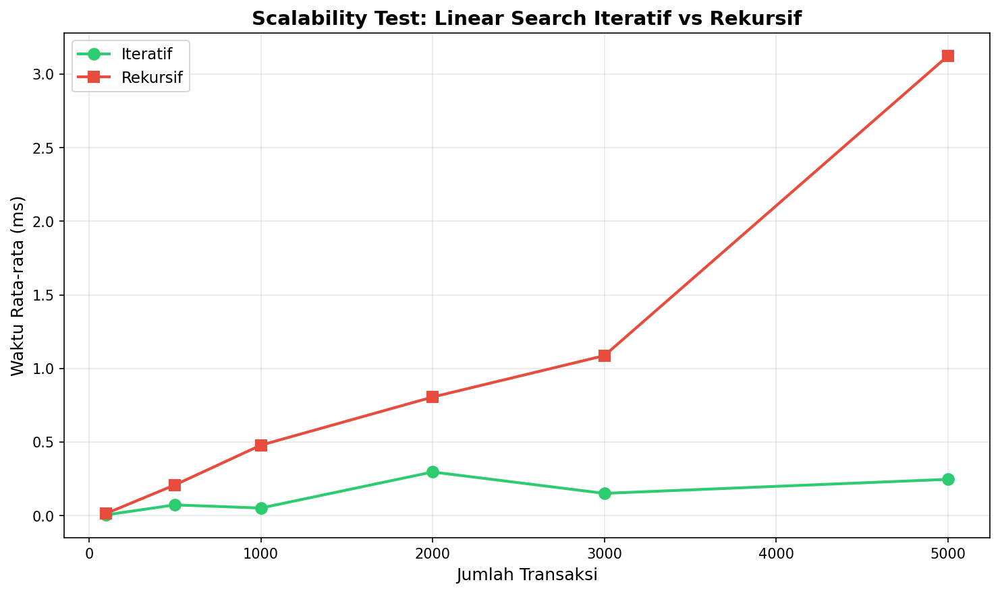

# Aplikasi Audit Transaksi Keuangan Bank

Tugas Besar Mata Kuliah Analisis Kompleksitas Algoritma

## Deskripsi

Program ini mensimulasikan sistem audit transaksi keuangan di bank dengan membandingkan dua pendekatan implementasi algoritma Linear Search:
- Linear Search Iteratif
- Linear Search Rekursif

Program bertujuan untuk memverifikasi keberadaan satu ID Transaksi (Target) dan mengecek isi data dari ID tersebut.

## Fitur

- Generate data transaksi dummy untuk simulasi
- Pencarian transaksi berdasarkan ID menggunakan Linear Search
- Perbandingan performa antara metode Iteratif dan Rekursif
- Visualisasi grafik perbandingan performa
- Scalability test dengan berbagai ukuran data

## Struktur Data Transaksi

| Field | Deskripsi |
|-------|-----------|
| ID Transaksi | Identifier unik transaksi (format: TRX000001) |
| Tanggal | Tanggal transaksi |
| Jenis | DEBIT atau KREDIT |
| Nominal | Jumlah uang dalam Rupiah |
| Rekening Asal | Nomor rekening pengirim |
| Rekening Tujuan | Nomor rekening penerima |
| Keterangan | Deskripsi transaksi |

## Algoritma Linear Search

### Iteratif
```python
def linear_search_iterative(transactions, target_id):
    for transaction in transactions:
        if transaction.id == target_id:
            return transaction
    return None
```

### Rekursif
```python
def linear_search_recursive(transactions, target_id, index=0):
    if index >= len(transactions):
        return None
    if transactions[index].id == target_id:
        return transactions[index]
    return linear_search_recursive(transactions, target_id, index + 1)
```

## Kompleksitas Algoritma

| Metode | Time Complexity | Space Complexity |
|--------|-----------------|------------------|
| Iteratif | O(n) | O(1) |
| Rekursif | O(n) | O(n) - karena call stack |

Keterangan:
- n = jumlah data transaksi
- Kedua metode memiliki time complexity yang sama yaitu O(n) untuk worst case
- Perbedaan utama terletak pada space complexity dimana rekursif membutuhkan ruang tambahan untuk call stack

## Cara Menjalankan

### Prasyarat
- Python 3.x
- Library matplotlib

### Instalasi
```bash
pip install matplotlib
```

### Menjalankan Program
```bash
python bank_audit.py
```

## Alur Program

1. Program generate 1000 data transaksi dummy
2. Menampilkan sample 5 data transaksi pertama
3. User memasukkan ID transaksi yang ingin dicari
4. Program melakukan pencarian dengan kedua metode
5. Menampilkan detail transaksi jika ditemukan
6. Menampilkan tabel perbandingan performa
7. Menampilkan grafik perbandingan
8. Opsi untuk menjalankan scalability test

## Hasil Perbandingan Performa

### Grafik Perbandingan Performa


Grafik di atas menampilkan:
- Bar chart rata-rata waktu eksekusi
- Box plot distribusi waktu eksekusi
- Line plot waktu eksekusi per iterasi

### Grafik Scalability Test


Grafik scalability test menunjukkan perbandingan waktu eksekusi kedua metode pada berbagai ukuran data (100, 500, 1000, 2000, 3000, 5000 transaksi).

## Kesimpulan

Berdasarkan hasil pengujian:
- Kedua metode memiliki kompleksitas waktu O(n) yang sama
- Metode iteratif lebih efisien dalam penggunaan memori karena tidak memerlukan call stack
- Metode rekursif memiliki keterbatasan pada ukuran data besar karena limit recursion depth
- Untuk aplikasi praktis dengan data besar, metode iteratif lebih disarankan

## Teknologi

- Python 3
- Matplotlib (visualisasi grafik)
