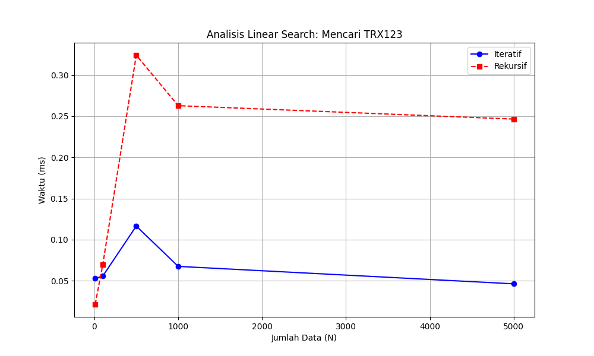

# Aplikasi Audit Transaksi Keuangan Bank

Tugas Besar Mata Kuliah Analisis Kompleksitas Algoritma

## Deskripsi

Program ini mensimulasikan sistem audit transaksi keuangan di bank dengan membandingkan dua pendekatan implementasi algoritma Linear Search:
- Linear Search Iteratif
- Linear Search Rekursif

Program bertujuan untuk memverifikasi keberadaan satu ID Transaksi (Target) dan menganalisis kompleksitas algoritma pada berbagai skenario.

## Fitur

- Generate database transaksi dengan ID berurutan (TRX1, TRX2, TRX3, ...)
- Data transaksi diacak secara random sebelum pencarian
- Panduan skenario untuk analisis grafik (Best Case, Average Case, Worst Case)
- Pencarian transaksi berdasarkan ID menggunakan Linear Search
- Perbandingan performa antara metode Iteratif dan Rekursif
- User dapat menentukan variasi N untuk analisis grafik
- Visualisasi grafik perbandingan performa

## Struktur Data Transaksi

| Field | Deskripsi |
|-------|-----------|
| ID Transaksi | Identifier unik transaksi (format: TRX1, TRX2, TRX3, ...) |
| Tanggal | Tanggal transaksi (2024-12-18) |
| Jenis | DEBIT atau KREDIT |
| Nominal | Jumlah uang dalam Rupiah (10.000 - 5.000.000) |
| Rekening Asal | Nomor rekening pengirim (10 digit) |
| Rekening Tujuan | Nomor rekening penerima (10 digit) |
| Keterangan | "Audit Data" |

## Algoritma Linear Search

### Iteratif
```python
def linear_search_iterative(transactions, target_id):
    for transaction in transactions:
        if transaction.id == target_id:
            return transaction
    return None
```

### Rekursif
```python
def linear_search_recursive(transactions, target_id, index=0):
    if index >= len(transactions): return None
    if transactions[index].id == target_id: return transactions[index]
    return linear_search_recursive(transactions, target_id, index + 1)
```

## Kompleksitas Algoritma

| Metode | Time Complexity | Space Complexity |
|--------|-----------------|------------------|
| Iteratif | O(n) | O(1) |
| Rekursif | O(n) | O(n) - karena call stack |

Keterangan:
- n = jumlah data transaksi
- Kedua metode memiliki time complexity yang sama yaitu O(n) untuk worst case
- Perbedaan utama terletak pada space complexity dimana rekursif membutuhkan ruang tambahan untuk call stack

## Cara Menjalankan

### Prasyarat
- Python 3.x
- Library matplotlib

### Instalasi
```bash
pip install matplotlib
```

### Menjalankan Program
```bash
python bank_audit.py
```

## Alur Program

1. User memasukkan jumlah database transaksi (N)
2. Program generate N data transaksi dengan ID berurutan (TRX1, TRX2, ...)
3. Data diacak secara random
4. Program menampilkan panduan skenario untuk analisis grafik:
   - **BEST CASE (Awal)**: ID di posisi pertama
   - **AVERAGE CASE (Tengah)**: ID di posisi tengah
   - **WORST CASE (Akhir)**: ID di posisi terakhir
5. User memasukkan ID transaksi yang ingin dicari
6. User memasukkan variasi N untuk skala grafik (pisahkan dengan koma)
7. Program menjalankan pengujian performa pada setiap variasi N
8. Menampilkan tabel perbandingan performa
9. Menampilkan grafik analisis Linear Search

## Contoh Output

```
============================================================
   SISTEM AUDIT BANK - KONTROL SKENARIO KOMPLEKSITAS
============================================================

Masukkan jumlah database transaksi (N): 1000
✓ 1000 data transaksi telah di-generate dan diacak.

------------------------------------------------------------
PANDUAN SKENARIO UNTUK ANALISIS GRAFIK:
------------------------------------------------------------
1. BEST CASE    (Awal)   : Gunakan ID TRX456
2. AVERAGE CASE (Tengah) : Gunakan ID TRX789
3. WORST CASE   (Akhir)  : Gunakan ID TRX123
------------------------------------------------------------

Masukkan ID Transaksi yang ingin dicari: TRX123

Masukkan variasi N untuk skala grafik (pisahkan koma).
Variasi N: 100,500,1000

→ Sedang menghitung performa Linear Search...

============================================================
Ukuran N   | Iteratif (ms)   | Rekursif (ms)  
------------------------------------------------------------
100        | 0.012345        | 0.015678       
500        | 0.056789        | 0.067890       
1000       | 0.123456        | 0.145678       
```

## Skenario Analisis

### Best Case (O(1))
- Target berada di posisi pertama array
- Kedua metode menemukan target dalam 1 iterasi

### Average Case (O(n/2))
- Target berada di posisi tengah array
- Rata-rata perlu mengecek setengah dari total data

### Worst Case (O(n))
- Target berada di posisi terakhir atau tidak ada
- Harus mengecek semua data dari awal sampai akhir

## Hasil Perbandingan Performa

### Grafik Analisis Linear Search


Grafik menunjukkan perbandingan waktu eksekusi kedua metode pada berbagai ukuran data yang diinput oleh user, dengan analisis berdasarkan posisi target dalam array.

**Interpretasi Grafik:**
- **Sumbu X**: Jumlah Data (N) - variasi ukuran database yang diuji
- **Sumbu Y**: Waktu Eksekusi (ms) - waktu yang dibutuhkan untuk menemukan target
- **Garis Biru (Iteratif)**: Menunjukkan performa metode iteratif
- **Garis Merah (Rekursif)**: Menunjukkan performa metode rekursif

**Pola yang Terlihat:**
- Kedua metode menunjukkan pertumbuhan linear sesuai dengan kompleksitas O(n)
- Metode iteratif cenderung sedikit lebih cepat karena overhead yang lebih rendah
- Pada data besar, perbedaan performa menjadi lebih signifikan
- Grafik akan berbeda tergantung skenario (Best/Average/Worst Case) yang dipilih

## Kesimpulan

Berdasarkan hasil pengujian:
- Kedua metode memiliki kompleksitas waktu O(n) yang sama
- Metode iteratif lebih efisien dalam penggunaan memori karena tidak memerlukan call stack
- Metode rekursif memiliki keterbatasan pada ukuran data besar karena limit recursion depth
- Posisi target dalam array sangat mempengaruhi waktu eksekusi (Best/Average/Worst Case)
- Untuk aplikasi praktis dengan data besar, metode iteratif lebih disarankan

## Teknologi

- Python 3
- Matplotlib (visualisasi grafik)
